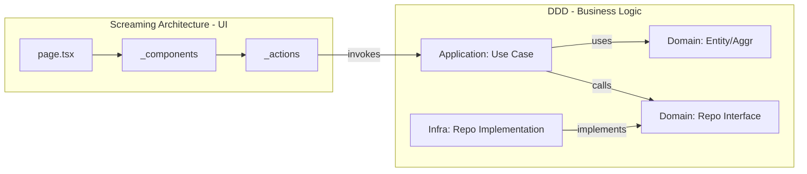

# Global Architecture Blueprint

This document defines the unbreakable architectural standards for this project. Every decision, file placement, and logic separation must prioritize these principles.

## 🏛️ The Dual Pattern Strategy

| Layer | Architecture Pattern | Core Goal |
| :--- | :--- | :--- |
| **Frontend** | **Screaming Architecture** | Immediate business clarity, high collocation, and feature-driven structure. |
| **Backend/Core** | **Domain Driven Design (DDD)** | Rich domain modeling, clear boundaries, and infrastructure decoupling. |

---

## 🏗️ 1. Frontend: Screaming Architecture (Next.js 15+)

The application structure must "scream" its purpose. A developer should know what the app *does* just by looking at the `src/app` directory.

### Core Rules:
1. **Route-First Collocation**: Keep components, hooks, actions, and types as close to the route that uses them as possible.
2. **Private Folders (`_folder`)**: Use folders prefixed with `_` to collocate logic within route groups without affecting the URL structure.
3. **Route Groups `(group)`**: Organize routes by business domain (e.g., `(dashboard)`, `(auth)`) to maintain a clean filesystem without segmenting the URL.
4. **Shared vs Local**: 
   - 1 Feature = Local placement (inside route/group folder).
   - 2+ Features = Shared placement (`src/shared` or `src/components/ui`).

**Recommended Structure:**
```text
src/app/
├── (auth)/                 # Business Domain: Authentication
│   ├── login/
│   │   ├── _components/    # Specific to Login
│   │   └── page.tsx
│   └── register/
├── (dashboard)/            # Business Domain: User Workspace
│   ├── _components/        # Shared only within Dashboard
│   └── page.tsx
└── shared/                 # Global UI (shadcn, etc.)
```

---

## 🧠 2. Backend & Core: Domain Driven Design (DDD)

All business rules, data persistence logic, and external integrations MUST follow DDD principles to ensure the core is independent of the framework (Next.js).

### Core Layers (`src/core`):
1. **Domain Layer**: 
   - **Entities & Aggregates**: Core objects with identity and behavior (e.g., `User`, `Order`).
   - **Value Objects**: Immutable data types (e.g., `Email`, `Price`).
   - **Repository Interfaces**: Define *how* the domain expects data to be handled.
   - **Domain Services**: Logic that doesn't fit into a single entity.
2. **Application Layer**: 
   - **Use Cases**: Orchestrate domain logic and side effects.
3. **Infrastructure Layer**: 
   - **Adapters**: Concrete implementations of repositories (Prisma, Drizzle), API clients (Stripe, SendGrid), etc.

### The Bridge: Next.js to DDD
- **Server Actions** act as **Adapters**. They receive input, validate it (Zod), and invoke a specific **Use Case** from the Application Layer.
- **API Routes** act similarly for external consumers.

---

## 🔄 Interaction Flow



## ⚖️ Enforcement Guidelines

- **No Framework in Domain**: The `src/core/domain` folder must NEVER import anything from `next/*`, `react`, or database libraries. It must be pure TypeScript.
- **No Direct DB in UI**: UI components and server pages should NEVER import `db` (Prisma/Drizzle) directly. They must use Server Actions or Use Cases.
- **Feature Isolation**: If you are working on the "Payment" feature, stay inside the `payment` folder/route. Do not add a `payment-button.tsx` to the global `components/` folder unless it is confirmed to be used in another unrelated feature.

---
**References:**
- Next.js Implementation: `pattern-next.md`
- DDD Technical Details: `clean-ddd-hexagonal` skill
